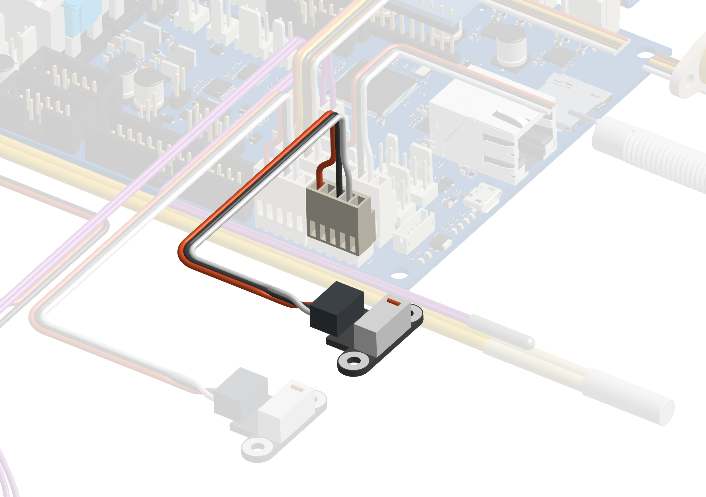
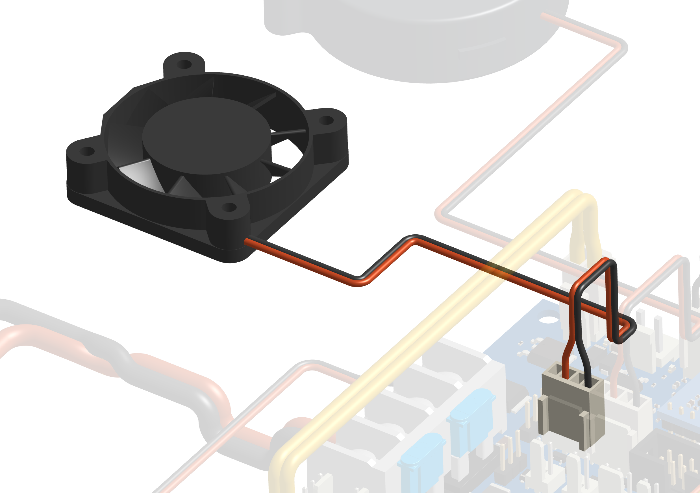
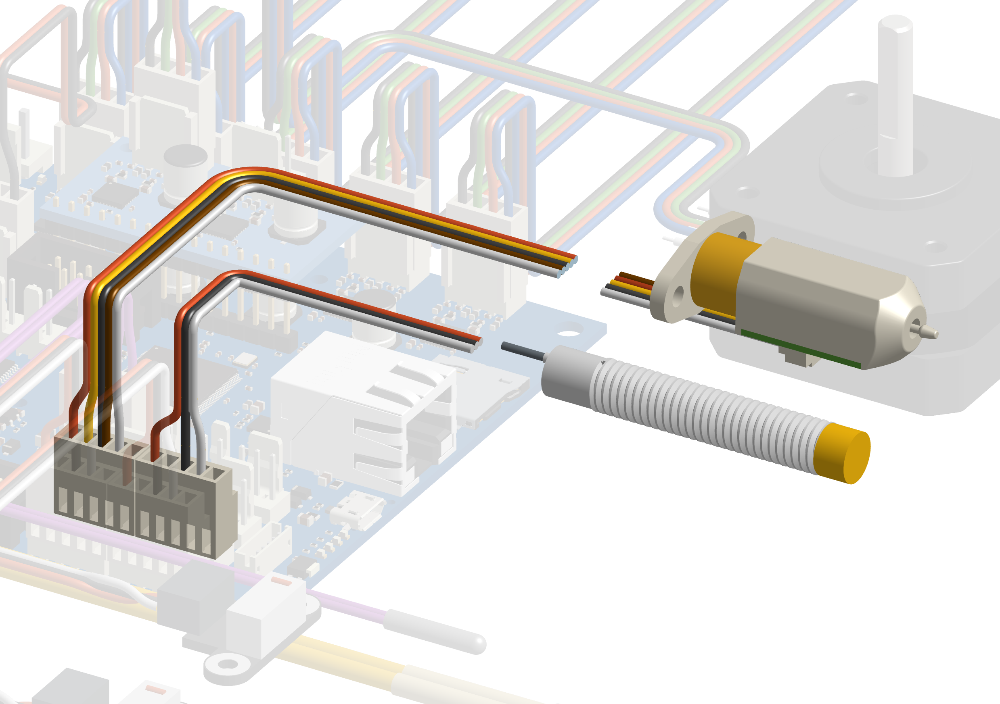
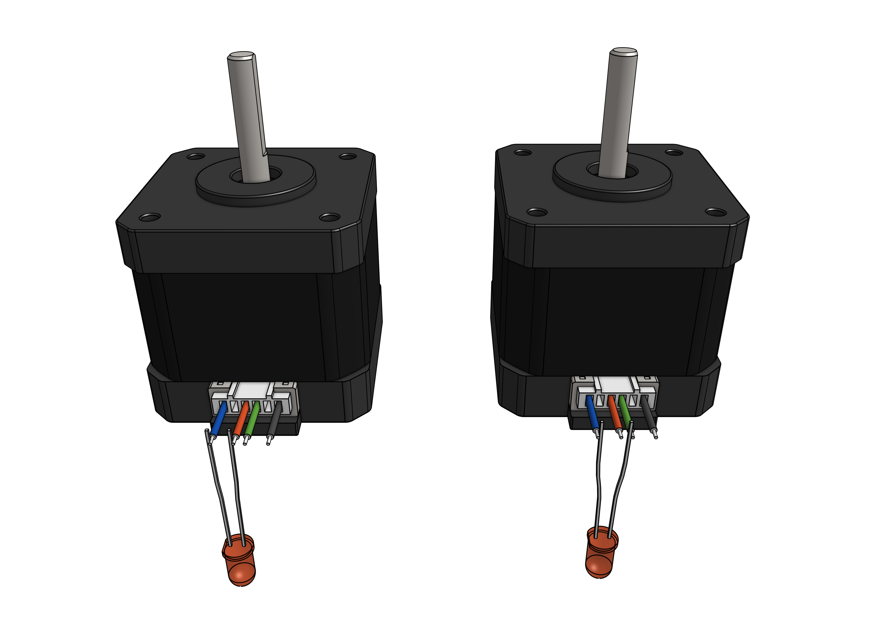
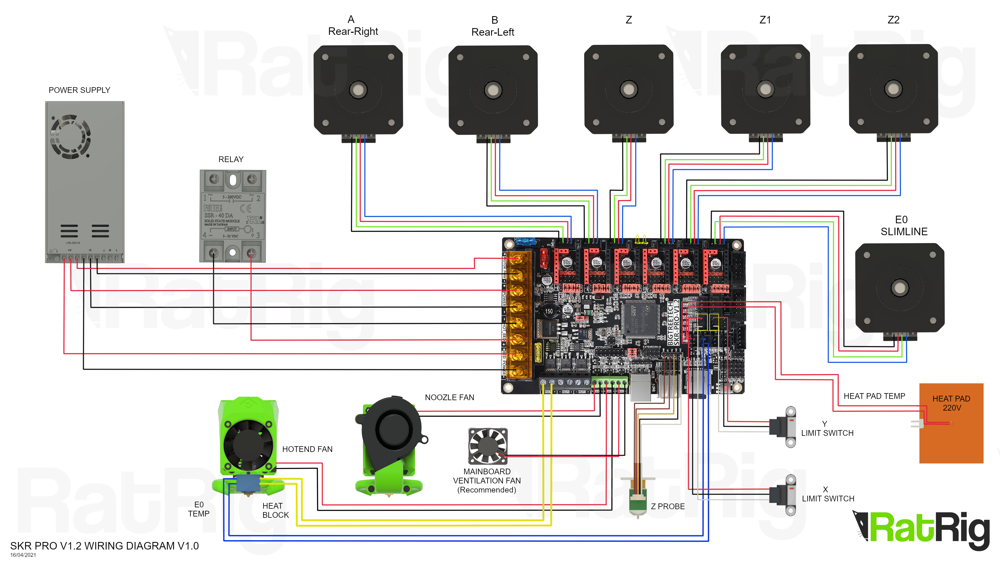

## Duet 3 Mini 5+ with Duet 3 Expansion Mini 2+

V-Core 3 runs on 6 drives which means a board able to handle 6 or more drives is required. Duet 3 Mini 5+ with the Mini 2+ expansion provides 7 drives which is more than enough. The following diagram presents a wiring example for V-Core 3 with that board configuration.
<figure>
  
  <figcaption>(click to enlarge)</figcaption>
</figure>

??? question "Zoom to endstop switch connection"

    

??? question "Zoom fan connection"

    

??? question "Zoom to bed probe connections"

    

??? info "Identifying Motor phases"

    A very detailed article on the matter is provided in [Duet 3D's documentation](https://duet3d.dozuki.com/Wiki/Choosing_and_connecting_stepper_motors#Section_Using_the_internal_drivers).

    Duet 3 boards use the `AABB` motor pinout. You need to identify your motor's phases to avoid damage to the board. Different models of NEMA17 stepper motors may have different pinout, i.e. your hefty 48mm XY motors may have a different pinout than a small, 25mm LGX motor.

    The trick to identify the motor pinout is to use a LED diode or a piece of wire and short two pins like on the example below and then rotate the shaft by hand. When shorting a phase the LED will light up or - if using the wire method - rotating the shaft will become much harder.

    

    If the LED lights up when set like in the left image, the motor's pinout is `AABB`, if it's lighting up when set like on the right image it's a `ABAB`, you also may run into a `ABBA` pinout.

    If your pinout is not `AABB` then you need to pull two pins from the connector and switch them, for e.g. you'd swap places of the two middle (red and green in the example above) wires on a `ABAB` pinout to achieve a `AABB` pinout.

    Additionally, you can swap the pins belonging to the same phase, i.e. `A+A-B+B-` to `A-A+B+B-` to reverse the motor's direction (which is more easily achieved by setting the `S` parameter in your `M569` in the [firmware](../firmware))

## SKR Pro 1.2

!!! attention "This section is stil a work in progress"

